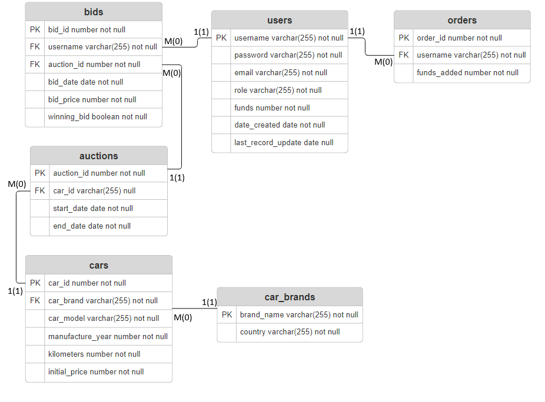

# Web Development with Spring
## Lab Project - Car Auction System

This project will make a car auction system, which will accomplish following Business Requirements
1. Register Account possibility
2. Login to access the platform
3. User can modify its password or username
4. User can list all the future auctions
5. User can add funds to his account (more likely a fake api that adds currency)
6. User can bid on auctions
7. User can check in realtime if its bid is still on
8. Admin can add new cars
9. Admin can start the auction on a period of time
10. User can see his won auctions

From these business requirements, following features must be implemented:
1. Role-based account system
    * "user" - for accessing the platform and main features
    * "admin" - same as user + possibility of adding cars and start the auctions for users
2. User can add funds to his account, in order to be able to bid on any auction
3. User can iterate through the platform's auctions, see the car's specifications, and be able to bid on it
4. User can see the current status of its bid
5. User must have its funds refunded when someone's outbids him on an auction
---
### Database Diagram
